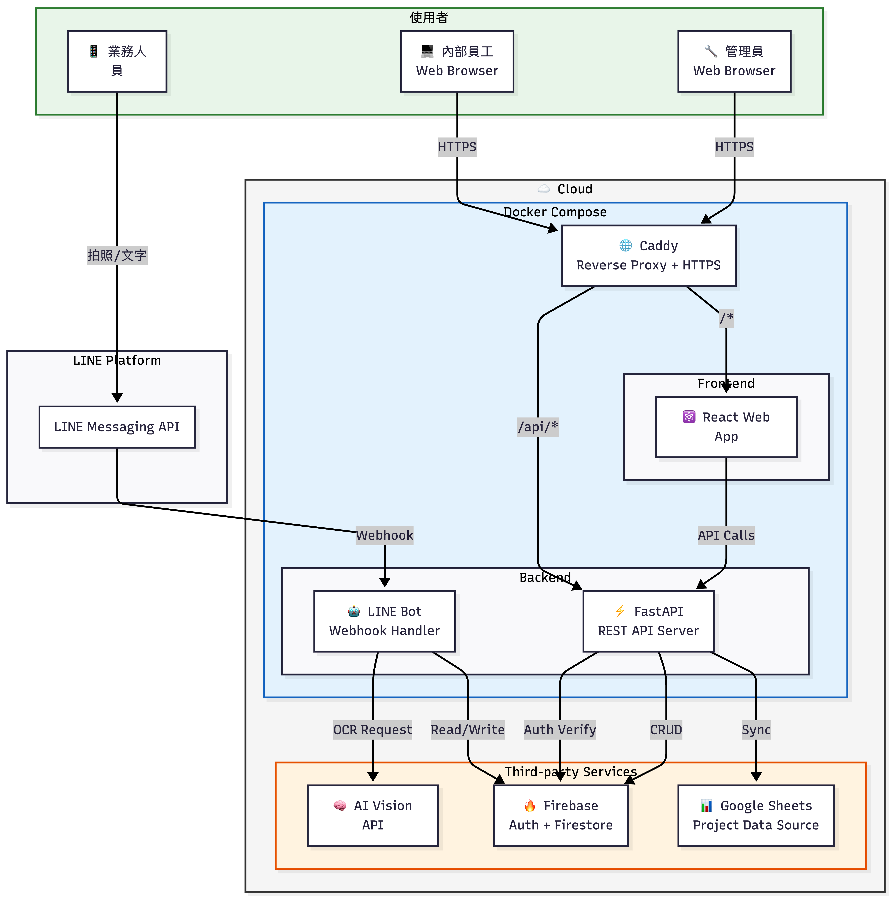
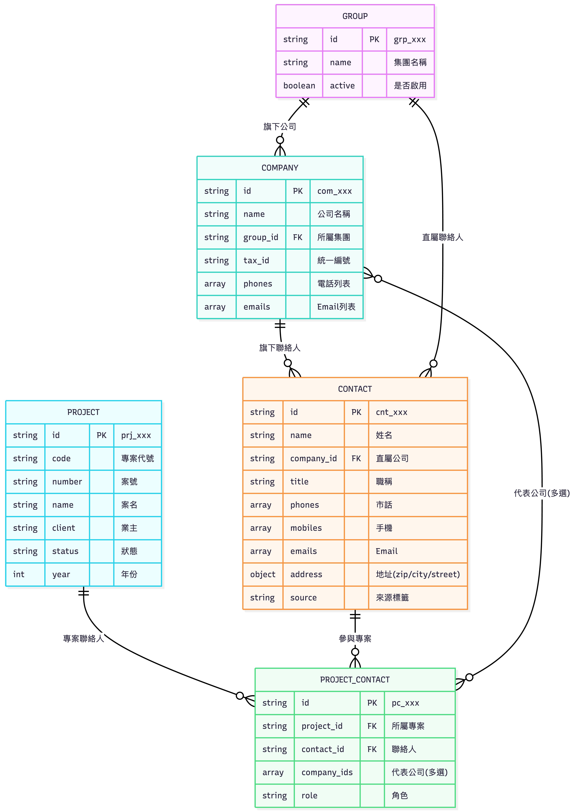
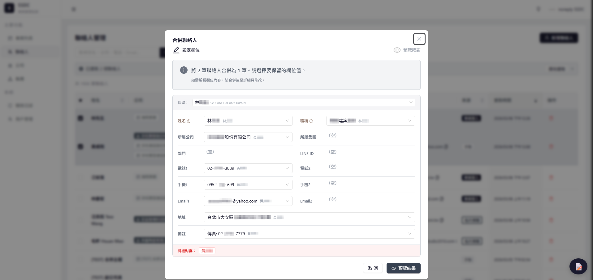
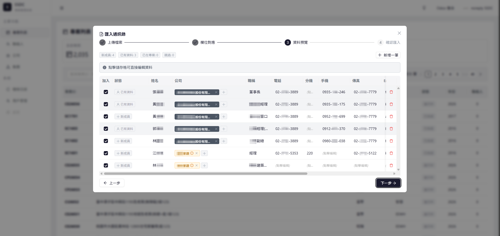
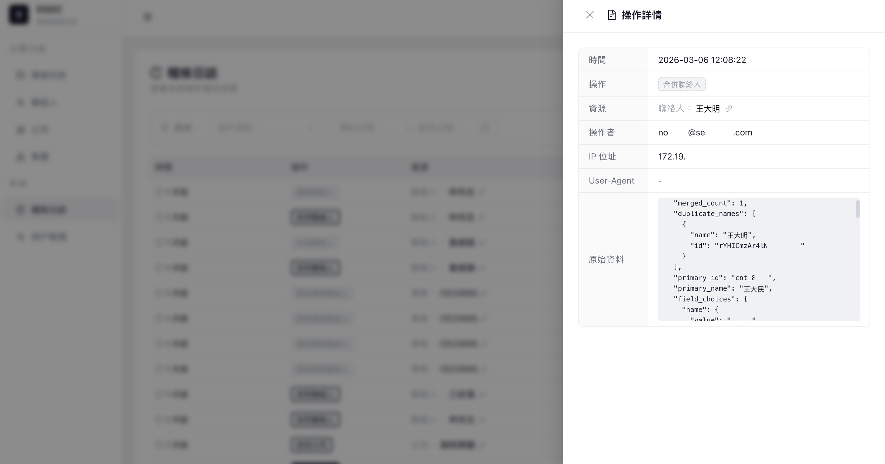

# Enterprise Contact Management System

> A full-stack CRM system built in 45 days by a solo developer.
> Manages 3,000+ contacts, 2,000+ projects for an engineering consulting firm.

---

## Features

### AI Business Card Scanner (LINE Bot)
Snap a photo of a business card via LINE, and the system automatically:
- Extracts 18 fields using AI Vision OCR
- Normalizes phone numbers (Taiwan format)
- Parses addresses into structured components
- Detects duplicate contacts before saving
- Presents an interactive confirmation flow

### Web Management Console
A modern React SPA for managing the full data lifecycle:
- **Contacts** — CRUD, search, sort, filter, bulk merge
- **Companies** — Hierarchy management, tax ID lookup
- **Groups** — Parent organization management
- **Projects** — Sync from external data sources
- **Audit Log** — Full operation history with change diffs

### Smart Import Wizard
4-step guided wizard for bulk importing from Excel:
1. Upload + automatic project detection
2. Column mapping (keyword-based auto-match)
3. Preview with data cleansing (phone separation, address parsing)
4. Batch import with duplicate detection

### Intelligent Merge Engine
Merge 2-5 duplicate records with field-level control:
- Auto-classifies fields: conflict / auto-inherit / identical
- Transfers all project associations to the primary record
- Soft-deletes duplicates (traceable via `mergedIntoId`)
- Full audit trail of merge operations

### Authentication & Authorization
- Google OAuth with domain restriction
- RBAC: admin / user / viewer
- Firebase JWT with LRU-cached verification
- Complete audit logging (who, when, what, from where)

---

## Architecture



---

## Data Model: Project-Centric Design

Traditional CRMs enforce a 1:1 relationship between a contact and a company.
In reality, the same person often represents **multiple companies across different projects**.



This design reflects real-world business relationships in the engineering/construction industry.

---

## Tech Stack

| Layer | Technology | Purpose |
|-------|-----------|---------|
| **Frontend** | React 19, JavaScript, Ant Design, Vite | SPA with enterprise UI components |
| **Backend** | FastAPI (Python) | High-performance async REST API |
| **Database** | Google Firestore | Serverless NoSQL with auto-backup |
| **AI** | GPT-4o (Vision) | Business card OCR with structured output |
| **Chat** | LINE Bot SDK | Mobile-first business card scanning |
| **Auth** | Firebase Authentication | Google OAuth + JWT |
| **Deploy** | Docker Compose, Caddy, GCP | Containerized deployment |
| **Sync** | Google Sheets API (gspread) | Automated project data sync |

---

## Key Technical Decisions

### Why Firestore over PostgreSQL?
Started with PostgreSQL (via ERP), migrated to Firestore for:
- Real-time read/write performance (10x improvement)
- Zero maintenance (fully managed)
- Automatic backups
- Better fit for document-oriented data model

### Why Write-Through Cache Invalidation?
- TTL-based caching caused data inconsistency windows
- Write-through invalidation: cache is cleared on every write operation
- Added Self-Healing Cache: auto-removes phantom records on read failures
- Result: Firestore reads dropped from 260K/day to <10K/day

### Why LINE Bot for OCR?
- Target users are field staff who are always on mobile
- LINE is the dominant messaging app in Taiwan (95%+ penetration)
- Zero installation, zero training — just send a photo
- Quick Reply buttons enable rapid field editing

---

## Performance Metrics

| Metric | Before | After |
|--------|--------|-------|
| Business card entry | 3-5 min/card | 10 sec/card |
| Excel import | 1-2 hours/file | 5 min/file |
| API response time | 200-500 ms | 20-50 ms |
| Database reads | 260K/day | <10K/day |
| Duplicate entries | Frequent | Near zero |

---

## Development Stats

| Metric | Value |
|--------|-------|
| Development period | 45 days |
| Total commits | 633 |
| Codebase size | 124,811 lines |
| Team size | 1 (solo developer) |
| Average commits/day | 14.1 |

---

## Project Timeline

```
Week 1    ERP Customization — Odoo module, Taiwan phone formatting
Week 2    LINE Bot — AI OCR, Flex Message UI, duplicate detection
Week 3-4  Web App — React SPA, Excel import, merge engine
Week 4    Auth & Audit — Firebase Auth, RBAC, operation logging
Week 5-6  Cloud Migration — Firestore migration, project sync, optimization
```

---

## License

This is a private enterprise system. Architecture diagrams and technical descriptions
are shared for portfolio/educational purposes only.

### Intelligent Merge Engine
*(The system intelligently highlights conflicts and allows field-level resolution while preserving data lineage)*


### Smart Import Wizard
*(4-step wizard with real-time duplicate detection and data cleansing)*


### Comprehensive Audit Logging & Traceability
*(Full operation history with field-level JSON diffs for enterprise security compliance)*


### Deep Dive & Case Studies
Want to see the thought process behind these features? Check out the detailed documentation:
- 📖 [Technical Architecture & Implementation Details](./docs/Enterprise專案技術思維與實作細節.md)
- 🎯 [STAR Method Case Studies (Problem Solving Scenarios)](./docs/Enterprise專案面試_STAR案例集.md)
